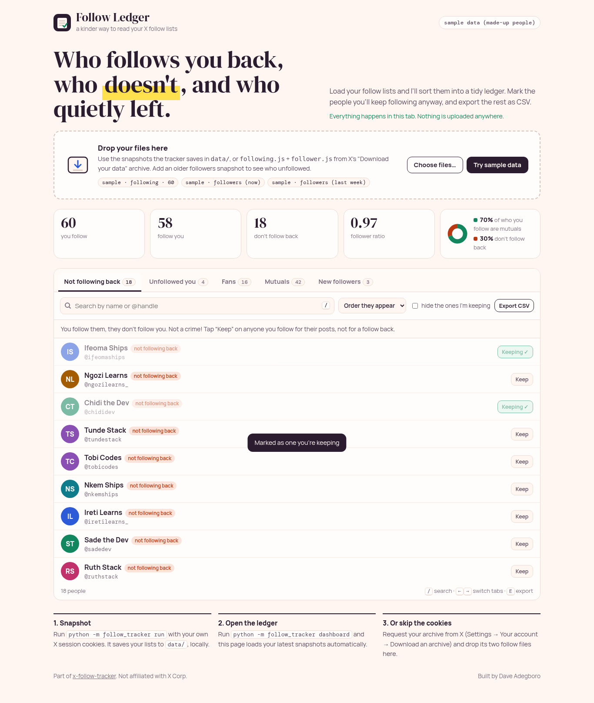
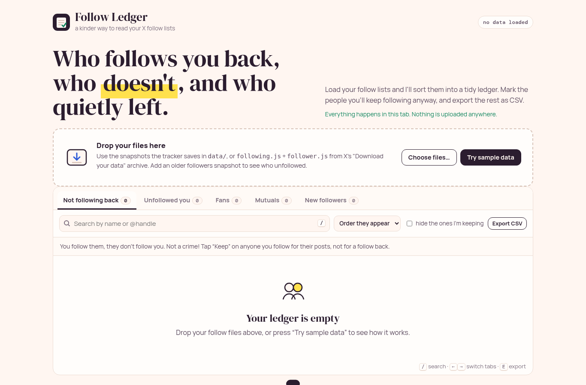
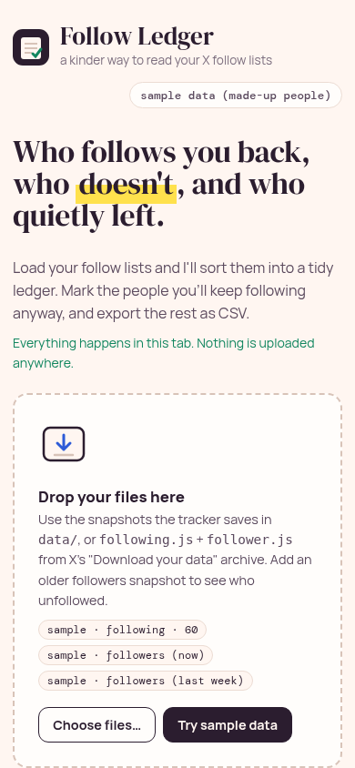

# X Follow Tracker · Follow Ledger

A small, local tool for the very human question "who doesn't follow me back, and who unfollowed me?" on X (Twitter). It snapshots your following/followers lists, diffs them over time, writes Markdown + CSV reports, and gives you **Follow Ledger**, a friendly dashboard to sort through the results.

I built it because the official API costs money for something this simple, and because most "unfollower" apps want your password. This runs on your own machine with your own session, and the dashboard also works with zero cookies if you use X's own data archive.

**Try Follow Ledger in your browser:** https://dave-4u.github.io/x-follow-tracker/ (sample data included; your files never leave the tab)



## What Follow Ledger gives you

- Tabs for **Not following back**, **Unfollowed you**, **Fans** (follow you, you don't follow them), **Mutuals**, and **New followers**
- A quick summary: counts, follower ratio, and a mutuals donut
- "Keep" anyone you follow for their posts, not for a follow back (remembered in your browser), then hide them
- Search (<kbd>/</kbd>), sort, switch tabs with <kbd>←</kbd>/<kbd>→</kbd>, export the current tab as CSV (<kbd>E</kbd>)
- Loads the tracker's `data/` snapshots automatically when you run `./run.sh`, or takes dropped files: tracker snapshots, or `following.js` + `follower.js` from **Settings → Your account → Download an archive**

| Empty state | On a phone |
|---|---|
|  |  |

## Quickstart

```bash
git clone https://github.com/Dave-4u/x-follow-tracker.git
cd x-follow-tracker
./run.sh              # Follow Ledger on http://127.0.0.1:8770 (no cookies needed)
cp .env.example .env  # add AUTH_TOKEN and CT0 from your browser (see below)
./run.sh run          # fetch once: unfollow diff + non-follow-back report + snapshots
./run.sh test         # 6 tests
```

> **Heads up:** this is an unofficial client that uses your browser session. Keep runs occasional (the client already pauses between pages), never share your cookies, and accept that X can change things or rate-limit at any time. The dashboard itself never talks to X.

Default account: `@officialdev05` (change it in `config.json` or with `config --set-username`).

## Commands

| Command | Purpose |
|---------|---------|
| `scan` | List accounts you **follow who do not follow back**. Writes Markdown + CSV under `out/`, and snapshots under `data/`. |
| `watch` | Compare current followers to the previous snapshot; report who **unfollowed** you. |
| `run` | One fetch: unfollow diff **and** non-follow-back report + snapshots. |
| `dashboard` | Open Follow Ledger over your saved snapshots (read-only, binds to 127.0.0.1). |
| `config` | Show or set the tracked username. |

## Requirements

- Python 3.10+ (3.11/3.12/3.13 fine)
- Your own X account cookies (`AUTH_TOKEN`, `CT0`) — kept only on **your** machine

## Manual setup (Windows, or without run.sh)

### 1. Create a venv

**macOS / Linux**

```bash
cd x-follow-tracker
python3 -m venv .venv
source .venv/bin/activate
pip install -r requirements.txt
python scripts/apply_twikit_patch.py
```

**Windows (cmd)**

```bat
cd x-follow-tracker
python -m venv .venv
.venv\Scripts\activate
pip install -r requirements.txt
python scripts\apply_twikit_patch.py
```

**Windows (PowerShell)**

```powershell
cd x-follow-tracker
python -m venv .venv
.\.venv\Scripts\Activate.ps1
pip install -r requirements.txt
python scripts\apply_twikit_patch.py
```

### 2. Get cookies from your browser

1. Log in to [https://x.com](https://x.com) in Chrome or Firefox.
2. Open DevTools → **F12** (or right-click → Inspect).
3. Go to **Application** (Chrome) or **Storage** (Firefox) → **Cookies** → `https://x.com`.
4. Copy:
   - `auth_token` → this is `AUTH_TOKEN`
   - `ct0` → this is `CT0`

Cookies expire over time. If requests start failing, repeat this step with fresh values.

### 3. Create `.env` (never commit this file)

```bash
cp .env.example .env
```

Edit `.env` and paste your values:

```env
AUTH_TOKEN=paste_auth_token_here
CT0=paste_ct0_here
```

Keep `.env` private. Do **not** email, chat, or upload these cookies.

### 4. (Optional) set username

Default is already `officialdev05` in `config.json`. To change:

```bash
# macOS / Linux (venv activated)
python -m follow_tracker config --set-username yourname

# Windows
.\.venv\Scripts\python.exe -m follow_tracker config --set-username yourname
```

Or edit `config.json` directly.

### 5. Run

> **Windows:** Do **not** use bare `python -m follow_tracker …` — that hits the system Python and usually fails with `ModuleNotFoundError: twikit`. Always use the venv interpreter or the helpers below.

**Windows (recommended)**

```powershell
# PowerShell — creates .venv / .env from example if needed, applies patches, then runs
.\run.ps1

# Or call the venv python directly:
.\.venv\Scripts\python.exe -m follow_tracker run
.\.venv\Scripts\python.exe -m follow_tracker scan
.\.venv\Scripts\python.exe -m follow_tracker watch
```

```bat
REM cmd.exe
run.bat
.venv\Scripts\python.exe -m follow_tracker run
```

**macOS / Linux**

```bash
# Help (works without cookies)
python -m follow_tracker --help

# Full pass: unfollow diff + non-follow-backs
python -m follow_tracker run

# Only non-follow-backs
python -m follow_tracker scan

# Only unfollow-since-last-snapshot
python -m follow_tracker watch
```

Without cookies, scan/watch/run exit with a clear message asking for `AUTH_TOKEN` and `CT0`.

## Outputs

| Path | Contents |
|------|----------|
| `out/non_followbacks_*.md` / `.csv` | Accounts you follow that do not follow back |
| `out/unfollows_*.md` / `.csv` | Accounts that unfollowed since the previous snapshot |
| `out/*_latest.*` | Most recent report copies |
| `data/following_*.json` | Snapshot of who you follow |
| `data/followers_*.json` | Snapshot of your followers |
| `data/*_latest.json` | Latest snapshot pointers used by `watch` |

First `watch`/`run` with no prior `data/` snapshot only saves a **baseline**. Run again later to see unfollows.

## Security notes

- Cookies act like a logged-in session. Treat them like a password.
- `.gitignore` excludes `.env`, `cookies.json`, `data/*`, and `out/*`.
- This tool never uses the official X API / MCP and does not need API credits.

## Troubleshooting

| Symptom | Fix |
|---------|-----|
| “Missing X session cookies” | Create `.env` from `.env.example` with real `AUTH_TOKEN` / `CT0` |
| Auth / 401-ish errors after a while | Re-copy cookies from the browser |
| `Couldn't get KEY_BYTE indices` | Run `python scripts/apply_twikit_patch.py` (Windows: `.\.venv\Scripts\python.exe scripts\apply_twikit_patch.py`). X changed a page format; twikit 2.3.3 needs this patch. |
| `KeyError: 'urls'` in `twikit/user.py` | Re-run the patch script (also patches `user.py`), or pull latest — runtime monkey-patch in `follow_tracker` hardens missing `entities.description.urls`. |
| `ModuleNotFoundError: twikit` | You used system `python` instead of the venv. On Windows: `.\.venv\Scripts\python.exe -m follow_tracker run` or `.\run.ps1`. |
| Rate limits / empty pages | Wait and re-run; the client pauses briefly between pages |
| Wrong account | `python -m follow_tracker config --set-username …` |

## Tech stack

Python 3.10+ · [twikit](https://github.com/d60/twikit) 2.3.3 (patched) · python-dotenv · stdlib `http.server` for the dashboard · vanilla HTML/CSS/JS (DM Serif Display + Manrope)

## Roadmap

- [ ] Follower history chart across all snapshots
- [ ] Optional scheduled `watch` with a desktop notification
- [ ] Profile details (bio, follower count) in the ledger when the snapshot has them
- [ ] Import from the Bluesky / Threads equivalents

## License

MIT, see [LICENSE](LICENSE). This is an unofficial client: use it responsibly and within X's terms. Not affiliated with X Corp.
